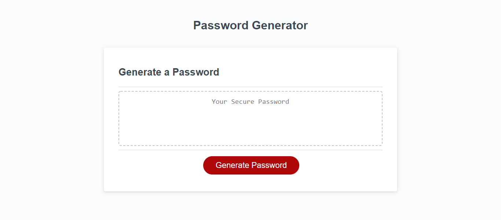

# Javascript-Password-Generator-HW
Using Javascript, we will build a Password Generator

- https://github.com/warrenhaskins1/js-password-generator

- https://warrenhaskins1.github.io/js-password-generator/

## Description
- This project was designed to teach us some fundamental basics of programming using
javascript.

-We built this project to see if we could combine the lessons in unit 3 effectively.

-This project is incomplete, but I got close....

## Installation 

- The only thing neccessary to use this project are a device with a web-browser and internet connection.

## Usage

-The user can follow prompt displayed on the screen to aquire a new random password.

## Credits
- https://gist.github.com/bendc/1e6af8f2d8027f2965da
- https://stackoverflow.com/questions/35004505/set-a-range-of-numbers-as-a-variable-javascript
- https://www.codegrepper.com/code-examples/javascript/javascript+create+list+of+numbers+1+to+n
- https://www.mikedane.com/web-development/javascript/getting-user-input/
- https://dzone.com/articles/ways-to-combine-arrays-in-javascript
- https://developer.mozilla.org/en-US/docs/Web/JavaScript/Reference/Global_Objects/Array/toString
